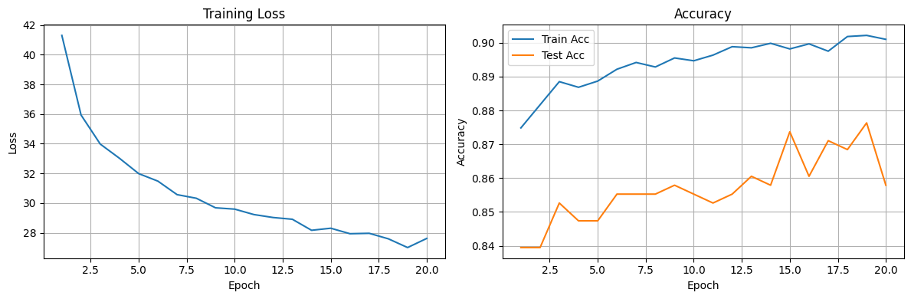

# Week3

> ### 모든 프로젝트는 데이터 로딩부터 전처리, 모델 구성, 학습 및 평가 시각화까지 PyTorch로 직접 구현하였습니다

- **DistilBERT 감정 분석 모델 실습 코드 분석 - Binary Classification**  
  [](https://github.com/zerovodka/ML-learning/blob/master/src/week3/DistilBERT-study.ipynb)
- **About AG_News Dataset**  
  [](https://github.com/zerovodka/ML-learning/blob/master/src/week3/AG_News.ipynb)
- **DistilBERT AG_News 기사 분류 모델 (`Basic`) - Multi-Class Classification**  
  [](https://github.com/zerovodka/ML-learning/blob/master/src/week3/solution/DistilBERT-solution-basic.ipynb)

---

- **MNLI Dataset**  
  [](https://github.com/zerovodka/ML-learning/blob/master/src/week3/MNLI.ipynb)

## `Basic Level`

[](https://github.com/zerovodka/ML-learning/blob/master/src/week3/solution/DistilBERT-solution-basic.ipynb)

- Hugging Face의 `DistilBERT pretrained-model` 활용
- `AG_News` 데이터셋을 분류하는 **NLP** 실습

### 목표

```plainText
- [x] AG_News dataset 준비
    - Huggingface dataset의 `fancyzhx/ag_news` 사용
    - train과 test 모두 5% 데이터만 사용
      - shuffle, seed를 활용한 reproducibility한 데이터셋 사용
    - collate_fn
        - Truncation과 관련된 부분들을 삭제
        - max_length 삭제
        - attention_mask return

- [x] Classifier output, loss function, accuracy function 변경
    - NewsClassifier Model 구축
      - AG News: Multi-Class Classification
        - CrossEntropyLoss()
        - load_dataset 시 output dimension 유동적으로 활용할 수 있도록 수정
          - num_classes
    - attention mask 적용
    - hidden state의 첫 번째 토큰 CLS를 통한 분류 task 해결
    - fine tuning
      - pretrained DistilBERT freeze 처리 후, 학습 타겟 픽스
      - model.zero_grad() => optimizer.zero_grad()를 통해 freeze 처리 외적인 부분에 대한 파라미터만 초기화화
    - Accuracy 측정
      - accuracy 내부에셔 eval() / no_grad() 처리
      - 학습 모델에 collate_fn에서 return한 input_ids, labels, attention_mask 일괄 입력
      - multi-class classification에 따른 argmax 처리

- [x] 학습 결과 report
    - Epoch 20 동안의 Train acc / Test acc / Train Loss 출력
    - history 누적하여 시각화
```

**주요 구현 사항**

- Hugging Face Datasets에서 AG News 데이터를 로드하여 텍스트 분류 수행
- `DistilBERT` 기반 분류 모델 구현: `NewsClassifier`
- custom `collate_fn`과 `DataLoader`를 활용한 학습 파이프라인 구성
- `CrossEntropyLoss`를 활용한 multi-class classification
- accuracy 평가 함수 구현
- reproducible한 데이터셋 구성

**Trouble Shooting**

```plainText
학습 결과 정확도가 굉장히 낮게 나왔고, 이를 해결한 과정을 적었습니다.
```

- attention_mask 처리
- 학습/평가 데이터 shuffle
- zero_grad() 처리 대상 수정
<details>
<summary>
  <strong>👈🏻 Trouble shooting 자세히 보기</strong>
</summary>
<div markdown="1">

- 기존 collate_fn은 attention_mask를 return하지 않아 model에서 모든 [PAD] 토큰을 참조하게되어있음<br>

```plainText
👉🏻 attention_mask를 collate_fn에서 input_ids, labels와 같이 딕셔너리로 묶어서 리턴
```

- Hugging Face에서 load_dataset할 때, split 문법으로 데이터를 기존처럼 split[:5%]로 잘라서오는 게 메모리적으로는 이득일지 몰라도, 학습/실험 데이터로는 적합하지 않음<br>

```plainText
👉🏻 학습 데이터를 전부 가져와서 seed 박아두고 shuffle 돌려서 데이터를 무작위로 가져와서 훈련/실험 진행하여 정확도 향상
```

- accuracy 함수 자체에서 eval, no_grad 처리

```plainText
👉🏻 이건 느낌적인 부분인데,  accuracy 호출부에서 쓰냐 내부에서 쓰냐에 대해 미세하게 차이가 있을 수 있다고 해서 accuracy 내부에서로 수정함
```

- epoch 증가

```plainText
👉🏻 freeze 처리를 하지만, 5 ~ 50 사이에서 실험적으로 고정되어있고 20으로 했더니 좀 오름
```

- 학습 파이프라인 내 model.zero_grad() => optimizer.zero_grad() 변경

```plainText
👉🏻 학습에 DistilBERT 모델을 freeze 처리해서 fine tuning을 하는데, 이 경우 model.zero_grad()를 사용하면 모델 전체의 파라미터에 대해 즉, encoder의 파라미터를 다 초기화해서 불필요한 계산도 진행되고 기존 파라미터 초기화되니 정확도가 낮아지는 거 같았음 (freeze 안하는 경우에는 이렇게 해도 차이가 없다고 한다)

그래서 Adam optimizer에 대해서만 zero_grad() 처리하게 바꾸면, freeze 부분 외의 실제로 학습을 요청한 부분만 초기화를 진행하기때문에 정확도가 올라갔습니다

그냥 어떤 경우던 optimizer.zero_grad()가 좋다고 한다
```

</div>
</details>

<br>

**최종 결과**  
<br>


## `Advanced Level`

- 어떤 task를 선택하셨나요?
    - MNLI task
- 모델은 어떻게 설계하셨나요? 설계한 모델의 입력과 출력 형태가 어떻게 되나요?
  - 전처리 과정에서 아래와 같이 구성해보았습니다
    ``` python
    data.append({
          'premise': row['premise'], 
          'hypothesis': row['hypothesis'], 
          'label': row['label'],
          'genre': row['genre'],
          'class': class_label(row['label'])
        })
    ```
  - premise와 hypothesis 두 문장으로 label 값을 추론해내는 문제로, output dimension이 0~2로 3인 태스크입니다
  
- 어떤 pre-trained 모델을 활용하셨나요?
  - 앞서 공부한 distilBERT 모델
  - GPT에게 추천받은 deBERTa-base 모델
  - 두 모델을 비교해보았습니다다

<!-- <details>
<summary>
Basic Level
</summary>
<div markdown="1">


</div>
</details> -->
